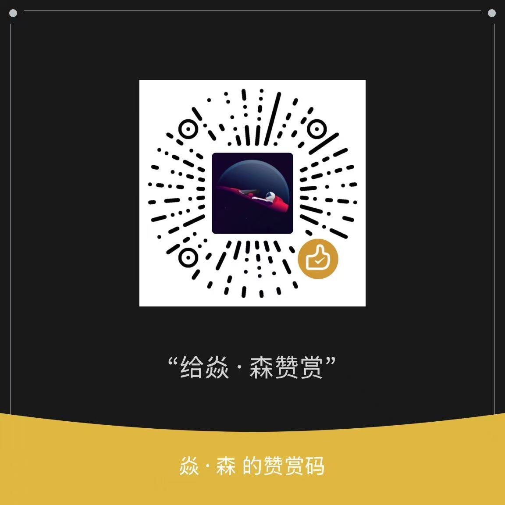

# AI Chat Navigator (AI 对话大纲助手)

> 👋 作者：**Jeff（大王）** — 独立开发者
> 📱 小红书 ID：[王路飞汐汐](https://www.xiaohongshu.com/user/profile/5cb950aa0000000011035bef)（206524823）
> 🔗 即刻 ID：[王路飞汐汐](https://okjk.co/uFbsJq)
> ⚠️ 为方便后续更新，请尽量使用**应用商店**安装。

<div align="center">

[](https://chromewebstore.google.com/detail/ai-chatnavigator/oaojjennjgmfnegjgnbikipnnddoiomg)
[](https://microsoftedge.microsoft.com/addons/detail/ai-chatnavigator/nimemminahdhnacieiaejaohgkehcned)
[](LICENSE)

**为 AI 对话自动生成大纲，支持快速导航和阅读位置定位**

[English README](README_EN.md) | [中文文档](README.md)

</div>

## 📖 简介

**AI Chat Navigator** 是一款强大的浏览器扩展，能在 AI 对话页面侧边栏自动生成结构化大纲，让你快速浏览问题列表、一键跳转到任意对话、精准定位阅读位置。

无论您是研究者、开发者还是学生，这款工具都能帮您高效浏览长对话，让 AI 灵感一目了然。

## ✨ 核心特性

- **多平台支持**：完美适配 DeepSeek、腾讯元宝、ChatGPT、豆包、Gemini、Grok、Kimi 等主流 AI 平台。
- **实时大纲生成**：基于页面 DOM 结构智能识别问题和答案，自动生成层级大纲。
- **快速导航**：点击大纲中任意标题即可跳转到对应对话位置。
- **阅读进度**：侧边栏实时指示当前阅读位置。
- **展开/折叠**：使用箭头按钮（▼/▶）快速控制答案区域的显示。
- **快捷键支持**：内置多个快捷键，操作更高效。

## 🚀 支持平台

| 平台 | 网址 | 支持内容 |
|------|------|----------|
| **DeepSeek** | deepseek.com | 对话、思考过程 (R1)、代码、搜索结果 |
| **腾讯元宝** | yuanbao.tencent.com | 对话、深度思考、参考链接、卡片内容 |
| **ChatGPT** | chatgpt.com | 对话、代码块、复杂嵌套结构 |
| **豆包 (Doubao)** | doubao.com | 对话、搜索来源 |
| **Gemini** | gemini.google.com | 对话、草稿内容 |
| **Grok** | grok.com | 对话、Markdown 内容 |
| **Kimi** | kimi.com | 对话、代码块、Markdown 格式 |

## 📥 下载安装

### 方式一：应用商店安装（推荐）

- **Chrome 用户**：[前往 Chrome 应用商店下载](https://chromewebstore.google.com/detail/ai-chatnavigator/oaojjennjgmfnegjgnbikipnnddoiomg)
- **Edge 用户**：[前往 Edge 插件商店下载](https://microsoftedge.microsoft.com/addons/detail/ai-chatnavigator/nimemminahdhnacieiaejaohgkehcned)

### 方式二：Releases 下载压缩包（免安装版）

适合不想走应用商店、或无法访问商店的用户：

1. 前往 [GitHub Releases 页面](https://github.com/Jeff-clouds/ChatNavigator/releases) 下载最新版本的 `.zip` 压缩包。
2. 解压到本地文件夹。
3. 打开 Chrome/Edge 浏览器，进入扩展管理页 (`chrome://extensions/` 或 `edge://extensions/`)。
4. 开启右上角的 **"开发者模式"**。
5. 点击 **"加载已解压的扩展程序"**，选择解压后的文件夹。

> 💡 历史版本也可在 Releases 页面下载，方便回退到稳定版本。

### 方式三：手动安装（开发者模式）

如果您想体验最新开发版功能：

1. 克隆本项目到本地：
   ```bash
   git clone https://github.com/Jeff-clouds/ChatNavigator.git
   ```
2. 直接加载项目目录即可，无需额外构建步骤。

3. 打开 Chrome/Edge 浏览器，进入扩展管理页 (`chrome://extensions/` 或 `edge://extensions/`)。
4. 开启右上角的 **"开发者模式"**。
5. 点击 **"加载已解压的扩展程序"**，选择本项目文件夹。

## 💡 使用指南

1. 打开任意支持的 AI 对话页面（如 [deepseek.com](https://deepseek.com)）。
2. 点击浏览器右上角的 **AI Chat Navigator** 图标。
3. 侧边栏会自动打开并生成当前页面的大纲。
4. 点击大纲中任意标题即可跳转到对应位置。
5. 使用箭头按钮（▼/▶）展开/折叠答案区域。

## ⌨️ 快捷键

| 快捷键 | 功能 |
|--------|------|
| `Ctrl+Shift+O` | 打开/关闭侧边栏 |
| `Alt+O` | 展开/折叠所有大纲项 |
| `Alt+J` | 跳转到下一个标题 |
| `Alt+K` | 跳转到上一个标题 |

## 🛠️ 开发与贡献

欢迎提交 Issue 或 Pull Request！

### 项目结构
- `src/core/background.js`: 核心逻辑，负责侧边栏管理和消息传递。
- `src/core/content.js`: 内容脚本，负责注入大纲生成逻辑。
- `src/core/pipeline.js`: 大纲生成管线。
- `src/core/sidepanel.js`: 侧边栏 UI 逻辑。
- `src/config/selectors.js`: 各平台的 DOM 选择器配置。
- `src/utils/common.js`: 工具函数。

### 本地开发
```bash
# 克隆仓库
git clone https://github.com/Jeff-clouds/ChatNavigator.git

# 在 Chrome/Edge 开发者模式下加载项目目录
```

## 📝 更新日志

| 日期 | 版本 | 更新内容 |
|------|------|----------|
| 2026-06-01 | v1.5.2 | 新增豆包平台支持，优化 DeepSeek/元宝选择器 |
| 2026-01-27 | v1.5.0 | 新增多平台支持，优化大纲生成 |
| 2025-12-01 | v1.0 | 初始版本，支持 DeepSeek 和元宝 |

> 📦 完整更新记录请查看 [GitHub Releases](https://github.com/Jeff-clouds/ChatNavigator/releases)

## 🗄️ 已归档插件

以下插件已停止维护，仅供学习参考：

| 插件 | 功能 | 下载 |
|------|------|------|
| **Deepseek.Chat.Viewer v1.0** | 一键收起 DeepSeek 思考过程，查看问题大纲 | [GitHub](https://github.com/Jeff-clouds/ChatNavigator/releases) |

## 📄 隐私政策

**AI Chat Navigator** 承诺：
- **不收集数据**：我们不收集您的任何对话内容、个人信息或浏览历史。
- **离线运行**：除了检查更新外，插件不需要连接任何第三方服务器。
- **本地存储**：所有数据均在本地处理。

## ☕ 请我喝杯咖啡

如果觉得这个项目对您有帮助，欢迎请作者喝杯咖啡 ☕️

<div align="center">
  
  
</div>

## ⚖️ 许可证

本项目基于 [MIT 许可证](LICENSE) 开源。

---

<div align="center">
如果这个项目对您有帮助，请给我们在 GitHub 上点个 ⭐ Star！
</div>
